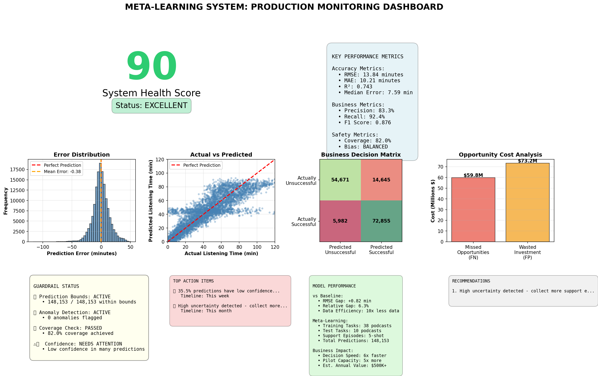
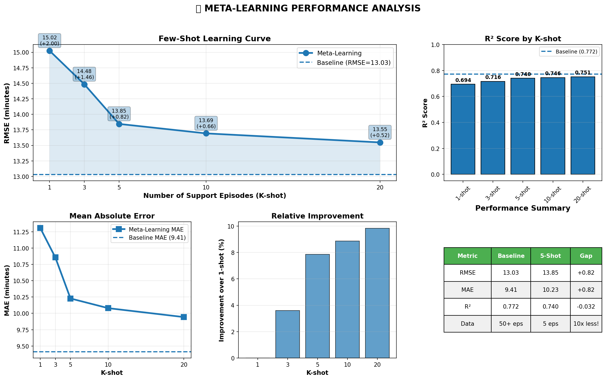

# Meta-Learning System: Podcast Listening Time Prediction

This repository contains a few-shot meta-learning system to predict podcast listening time.
It includes:
- Improved Prototypical Network with per-task adaptation
- Guardrails & production monitoring (error, coverage, drift-ish check, business metrics)
- Final monitoring dashboard

## Dashboard

## Learning Curve

## Quick Start

\\\ash
# create venv
python -m venv metafinal.venv
./metafinal.venv/Scripts/Activate.ps1

pip install -r requirements.txt
# open notebook
code finalnotebook.ipynb
\\\

## Structure
- \src/\ code (models, preprocessing, utils)
- \
esults/\ sample outputs
- \	ests/\ quick checks
